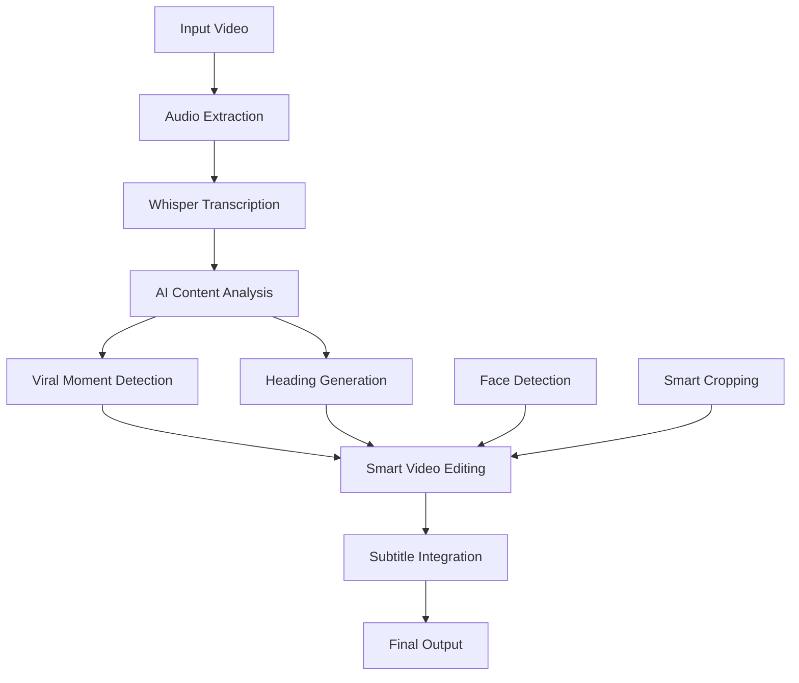
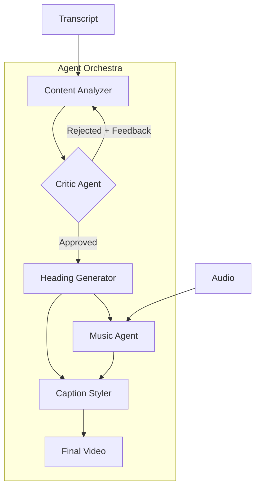

# PRISM: AI-Powered Viral Video Creator
## Architecture Overview & Technical Deep Dive

> **PRISM** transforms long-form videos into viral short-form content using advanced AI pipeline orchestration, computer vision, and multi-agent LLM systems.

---

## 🎯 **Project Vision**

PRISM eliminates the tedious manual process of creating viral short-form content. Using cutting-edge AI, it automatically identifies the most engaging moments in long videos, applies smart editing techniques, and outputs polished content optimized for TikTok, Instagram Reels, and YouTube Shorts.

## 🏗️ **System Architecture**

### **Core Pipeline (LangGraph-Orchestrated)**



### **Technology Stack**

| **Layer** | **Technology** | **Purpose** |
|-----------|----------------|-------------|
| **Orchestration** | LangGraph + LangChain | Multi-step AI workflow management |
| **LLM Providers** | OpenRouter, OpenAI, Gemini | Content analysis & decision making |
| **Speech Recognition** | OpenAI Whisper (Local) | Timestamped transcription |
| **Video Processing** | MoviePy 2.x | Professional video editing |
| **Computer Vision** | MediaPipe + OpenCV | Face detection & smart cropping |
| **Web Interface** | Streamlit | Execution flow visualization |
| **Package Management** | UV | Fast dependency resolution |

---

## 🤖 **Multi-Agent AI System**

PRISM uses a sophisticated multi-agent architecture where specialized AI agents collaborate to produce viral content:



### **Agent 1: Content Analyzer**
- **Role**: Viral moment detection expert
- **Input**: Full video transcript with precise timestamps
- **Output**: Structured cuts with start/end times and transition types
- **Capabilities**: 
  - Identifies emotional peaks and engagement hooks
  - Selects optimal segment duration (15-60 seconds)
  - Chooses appropriate transitions (cut, crossfade, fade-to-black)
  - **Accepts critic feedback** for iterative improvement

### **Agent 2: Critic Agent** *(NEW - ITERATIVE REFINEMENT)*
- **Role**: Narrative coherence evaluator
- **File**: `critic_agent.py`
- **Purpose**: Ensures selected clips form a complete, coherent story
- **Evaluation Criteria**:
  - **Narrative Completeness**: Beginning, middle, end
  - **Logical Flow**: Clips connect logically
  - **Context Alignment**: Content matches heading/topic
  - **Engagement**: Viewers can follow the story
- **Process**:
  1. Reviews clip selection from Content Analyzer
  2. Scores coherence (1-10 scale)
  3. If score < 7: REJECT with specific feedback
  4. Content Analyzer retries with feedback (max 3 attempts)
  5. Uses best attempt if max retries reached
- **Output**: Approval/rejection with detailed suggestions

### **Agent 3: Heading Generator**
- **Role**: Social media caption expert
- **Input**: Video content context
- **Output**: Contextual, engaging headlines (8-12 words)
- **Style**: News-caption format optimized for viral engagement

### **Agent 4: Speech Recognition Engine**
- **Role**: Audio-to-text conversion with timing precision
- **Technology**: Local Whisper "base" model
- **Features**: Word-level timestamps for dynamic subtitle placement

### **Agent 5: Music Agent**
- **Role**: Intelligent background music integration
- **File**: `music_agent.py`
- **Capabilities**:
  - **Mood Analysis**: LLM-powered content mood detection (energetic, dramatic, chill, etc.)
  - **Track Selection**: Curated royalty-free music library matching
  - **Professional Audio Ducking**: Automatic volume reduction during speech
  - **Beat Matching**: Music transitions aligned with video cuts
- **Technical Features**:
  - Exponential attack/release curves for smooth ducking
  - Configurable duck levels and fade durations
  - Multi-format audio support (MP3, WAV, OGG, M4A)

### **Agent 6: Caption Styler**
- **Role**: Dynamic TikTok-style animated captions
- **File**: `caption_styler.py`
- **Style Presets**:
  - **HORMOZI**: Alex Hormozi-style big word pops (recommended)
  - **TIKTOK**: Classic centered bold captions
  - **NEWS**: Lower-third news banner style
  - **KARAOKE**: Word-by-word highlighting
  - **IMPACT**: High-impact with dramatic effects
  - **GRADIENT**: Colorful gradient text
  - **MINIMAL**: Clean, professional subtitles
- **Features**:
  - Automatic emphasis detection for keywords
  - Color coding by word importance (numbers=green, exclamations=red)
  - Optional emoji integration based on sentiment
  - Configurable positioning and animations

---

## 🎬 **Advanced Video Processing Pipeline**

### **Smart Cropping System**
```python
# MediaPipe-powered face detection
face_detection → intelligent_crop_selection → 9:16_aspect_ratio
```
- **Face Tracking**: Automatically centers on speakers/subjects
- **Fallback Strategy**: Center crop when no faces detected
- **Output Format**: 1080x1920 (optimal for mobile social platforms)

### **Dynamic Caption System** *(ENHANCED)*
```python
# Caption styling pipeline
word_timing → emphasis_detection → style_application → color_coding → animation
```
- **Word-Level Timing**: Precise synchronization with speech via Whisper
- **7 Style Presets**: From minimal to high-impact Hormozi style
- **Automatic Emphasis**: Keywords, numbers, and exclamations highlighted
- **Color Coding**: Different colors for different word types
- **Professional Typography**: Configurable fonts, strokes, and shadows

### **Background Music System** *(NEW)*
```python
# Music integration pipeline
transcript → mood_analysis → track_selection → audio_ducking → mixing
```
- **AI Mood Detection**: LLM analyzes content for optimal music matching
- **Professional Ducking**: Smooth volume curves during speech
- **Library Management**: Organized by mood (energetic, dramatic, chill, etc.)
- **Seamless Integration**: Fade in/out with configurable durations

### **Transition Intelligence**
- **Cut Types**: Hard cuts, crossfades, fade-to-black
- **Context-Aware**: AI selects transitions based on content flow
- **Seamless Integration**: Professional editing quality

---

## 📊 **Data Architecture**

### **State Management (TypedDict)**
```python
VideoState = {
    "input_video_path": str,
    "transcript_segments": List[{start, end, text}],
    "cuts": List[{start, end, reason, transition}],
    "heading": str,
    "output_video_path": str,
    "parameters": Dict[Any]
}
```

### **Structured LLM Outputs (Pydantic)**
```python
class VideoCut(BaseModel):
    start: float
    end: float  
    reason: str
    transition: Literal["cut", "crossfade", "fade_to_black"]

class AnalysisResult(BaseModel):
    cuts: List[VideoCut]
    order: Optional[List[int]]
```

---

## 🛠️ **Development & Debugging Infrastructure**

### **Execution Visualization**
- **Streamlit Interface**: Real-time workflow monitoring
- **LLM Debug View**: Inspect AI decision-making process
- **Error Tracking**: Comprehensive failure analysis

### **Development Optimizations**
- **Transcript Caching**: `.dev_cache/` for faster iteration
- **Structured Logging**: `execution_logs.jsonl` for debugging
- **Provider Abstraction**: Easy switching between LLM providers

### **Robust Error Handling**
- **Retry Logic**: Exponential backoff for API failures
- **Response Parsing**: Handles markdown-wrapped JSON from different providers
- **Graceful Fallbacks**: Maintains functionality during partial failures

---

## 🚀 **Key Technical Achievements**

1. **Multi-Agent Architecture**: 5 specialized AI agents working in concert
2. **Multi-Provider LLM Integration**: Not locked to single AI provider
3. **Local AI Processing**: Whisper runs entirely offline for privacy
4. **Professional Video Quality**: MoviePy ensures broadcast-grade output
5. **Modular Architecture**: LangGraph enables easy pipeline extension
6. **Production-Ready**: Comprehensive logging, error handling, and caching
7. **Professional Audio**: Background music with studio-quality ducking
8. **Viral-Optimized Captions**: 7 style presets including Hormozi-style impact text

---

## 📈 **Performance Characteristics**

- **Processing Time**: ~3-5 minutes for 10-minute input video
- **Output Quality**: 1080x1920 @ 30fps with embedded subtitles
- **Memory Usage**: Optimized for consumer hardware
- **Scalability**: Pipeline-based architecture supports batch processing

---

## 🎯 **Current Capabilities**

✅ **Fully Automated**: Zero manual intervention required  
✅ **Multi-Format Support**: MP4, MOV, AVI input formats  
✅ **Professional Output**: Broadcast-quality short-form videos  
✅ **AI-Driven Decisions**: Intelligent content analysis and editing  
✅ **Social Media Optimized**: Perfect format for TikTok/Instagram/YouTube  
✅ **Developer Friendly**: Comprehensive debugging and visualization tools  
✅ **Background Music**: AI-selected music with professional audio ducking  
✅ **Dynamic Captions**: 7 viral caption styles with automatic emphasis detection  
✅ **Multi-Agent System**: 5 specialized AI agents for different tasks  

---

## 📁 **Project Structure**

```
PRISM/
├── video_graph.py          # Main LangGraph pipeline orchestration
├── llm_core.py             # LLM interaction & structured output
├── model_factory.py        # Multi-provider LLM factory
├── music_agent.py          # 🎵 Background music agent (NEW)
├── caption_styler.py       # 🎨 Dynamic caption styling (NEW)
├── visualize.py            # Streamlit execution visualizer
├── ARCHITECTURE.md         # This document
├── HACKATHON_IMPROVEMENTS.md # Future enhancement roadmap
├── requirements.txt        # Python dependencies
├── music_library/          # Royalty-free music organized by mood
│   ├── energetic/
│   ├── dramatic/
│   ├── chill/
│   └── ...
└── .dev_cache/             # Transcript cache for fast iteration
```

---

## 🔮 **Future Enhancement Opportunities**

*See the "HACKATHON_IMPROVEMENTS.md" section for detailed enhancement proposals that will blow away the judges.*

---

**Built with Python 3.11+ | Powered by OpenAI Whisper + LangChain + MoviePy + Multi-Agent AI | Optimized for Viral Content Creation**